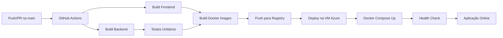

# 🦆 Primordial Duck Operation

Sistema completo para catalogação, análise e operações de captura de Patos Primordiais, desenvolvido para o desafio **"O Enigma dos Patos Primordiais"** - Dsin Coder Challenge 2025.

> **Repositório Full-Stack**: Backend (.NET 9) + Frontend (React) + Docker em um único repositório Git.

## 🌐 Aplicação em Produção

A aplicação está disponível nos seguintes endereços:

- **Frontend (Interface Web)**: http://172.172.122.181:8080/
- **Backend (API Swagger)**: http://172.172.122.181:7000/swagger/index.html

### 🚀 Deploy Automatizado

A aplicação é implantada automaticamente em uma **VM Azure Linux Ubuntu 22.04 B1ms** através de pipeline CI/CD.

**Infraestrutura**:
- **Servidor**: Azure Virtual Machine
- **SO**: Ubuntu 22.04 LTS
- **Tamanho**: B1ms (1 vCPU, 2 GB RAM)
- **Container Runtime**: Docker + Docker Compose
- **CI/CD**: GitHub Actions (Continuous Integration & Continuous Deployment)

**Pipeline de Deploy**:
1. **CI (Continuous Integration)**:
   - Build automático do backend (.NET 9)
   - Build automático do frontend (React + Vite)
   - Testes unitários
   - Geração de imagens Docker

2. **CD (Continuous Deployment)**:
   - Push das imagens para container registry
   - Deploy automático na VM Azure
   - Restart dos containers via Docker Compose
   - Health check da aplicação

Cada commit na branch `main` dispara automaticamente a pipeline de CI/CD, garantindo que a versão em produção esteja sempre atualizada.

## 📚 Documentação Detalhada

Para informações técnicas aprofundadas sobre cada parte do projeto, consulte:

- **[📖 Backend - Documentação Completa](./backend/README.md)**
  - Arquitetura Clean Architecture/DDD
  - Camadas do projeto e suas responsabilidades
  - Como executar localmente
  - Comandos úteis do Entity Framework
  - Tecnologias e padrões utilizados

- **[📖 Frontend - Documentação Completa](./frontend/primordial-duck-frontend/README.md)**
  - Arquitetura Component-Based
  - Estrutura de pastas e organização
  - Como executar localmente
  - Tecnologias React e Vite
  - Boas práticas implementadas

## 📑 Índice

- [🎯 Sobre o Projeto](#-sobre-o-projeto)
- [🏗️ Arquitetura do Projeto](#️-arquitetura-do-projeto)
- [🎮 Funcionalidades do Sistema](#-funcionalidades-do-sistema)
  - [📋 Missão 1: Catalogação](#-missão-1-catalogação-de-patos-primordiais)
  - [📊 Missão 2: Análise de Captura](#-missão-2-operação-visão-de-captura)
  - [🚁 Missão 3: Operação de Captura](#-missão-3-operação-de-captura)
- [🚀 Como Executar](#-como-executar-o-projeto)
- [🚢 Deploy e CI/CD](#-deploy-e-cicd)
- [📱 Navegação do Sistema](#-navegação-do-sistema)
- [📡 Endpoints da API](#-endpoints-da-api)
- [🎨 Tecnologias Utilizadas](#-tecnologias-utilizadas)
- [🧪 Fluxo de Uso](#-fluxo-de-uso-do-sistema)
- [🐛 Troubleshooting](#-troubleshooting)
- [👥 Autor](#-autor)

---

## 🎯 Sobre o Projeto

O **Primordial Duck Operation** é um sistema desenvolvido para auxiliar a DSIN (Divisão Secreta de Inteligência Nacional) no gerenciamento de operações relacionadas aos Patos Primordiais - seres ancestrais com poderes extraordinários que estão emergindo de sua hibernação milenar.

## 🏗️ Arquitetura do Projeto

### 📦 Estrutura Geral
```
PrimordialDuckOperation/
├── backend/                      # API .NET 9
│   ├── PrimordialDuckOperation.Api/           # Controllers e Middleware
│   ├── PrimordialDuckOperation.Application/   # Services, DTOs, Commands, Queries
│   ├── PrimordialDuckOperation.Domain/        # Entidades, Value Objects, Interfaces
│   ├── PrimordialDuckOperation.Infrastructure/# EF Core, Repositories, Migrations
│   ├── PrimordialDuckOperation.CrossCutting/  # DI, JWT, Swagger
│   └── PrimordialDuckOperation.Tests/         # Testes unitários
├── frontend/primordial-duck-frontend/         # SPA React
└── docker-compose.yml                         # Orquestração de containers
```

### 🎯 Backend (.NET 9 C#) - Clean Architecture/DDD

#### **Camada de Domínio** (`Domain`)
- **Entidades**: `Drone`, `PrimordialDuck`, `SuperPower`, `CaptureOperation`, `User`
- **Value Objects**: `HeightMeasurement`, `WeightMeasurement`, `Location`, `PrecisionMeasurement`
- **Enums**: `DroneTypeEnum`, `HibernationStatusEnum`, `SuperPowerClassificationEnum`, `CaptureStrategyEnum`, `DefenseTypeEnum`, `CaptureResultEnum`
- **Interfaces de Repositório**: Contratos para acesso a dados
- **Regras de Negócio**: Encapsuladas nas entidades

#### **Camada de Aplicação** (`Application`)
- **Services**: 
  - `AuthService` - Autenticação e gerenciamento de usuários
  - `CaptureAnalysisService` - Análise de viabilidade de captura (4 métricas)
  - `CaptureStrategyService` - Geração de estratégias e defesas
  - `EmailService` - Integração com EmailJS
- **DTOs**: Objetos de transferência de dados
- **Commands/Queries**: Separação de operações de leitura e escrita
- **Interfaces**: Contratos de serviços

#### **Camada de Infraestrutura** (`Infrastructure`)
- **Entity Framework Core 9.0**: ORM principal
- **Repositories**: Implementação do Repository Pattern
- **Configurations**: Fluent API para mapeamento (nomes em PT-BR)
- **Migrations**: Controle de versão do banco de dados
- **DataSeeder**: População inicial de dados

#### **Camada de API** (`Api`)
- **Controllers**: `AuthController`, `DronesController`, `PrimordialDucksController`, `SuperPowersController`, `CaptureOperationsController`
- **Middleware**: `ExceptionHandlerMiddleware` para tratamento global de erros
- **Program.cs**: Configuração da aplicação

#### **Camada CrossCutting** (`CrossCutting`)
- **Dependency Injection**: Registro de serviços
- **JWT Authentication**: Configuração de autenticação
- **Swagger/OpenAPI**: Documentação interativa da API
- **CORS**: Configuração de origens permitidas

### 🎨 Frontend (React 19 + Vite 7)

#### **Padrões de Arquitetura**
- **Component-Based Architecture**: Componentes reutilizáveis
- **Context API**: Gerenciamento de estado global (AuthContext)
- **Custom Hooks**: Lógica compartilhada (useAuth)
- **Service Layer**: Camada de serviços para comunicação com API

#### **Estrutura de Pastas**
```
src/
├── components/          # Componentes reutilizáveis
│   ├── Layout.jsx      # Layout principal
│   ├── FilterPanel.jsx # Filtros genéricos
│   └── Pagination.jsx  # Paginação
├── pages/              # Páginas da aplicação
├── contexts/           # Context API (AuthContext)
├── services/           # Chamadas à API
├── App.jsx             # Rotas principais
└── main.jsx           # Entry point
```

#### **Tecnologias Principais**
- **React 19.1.1**: Biblioteca UI
- **React Router 7.9.4**: Roteamento SPA
- **Axios**: Cliente HTTP
- **EmailJS**: Envio de emails
- **CSS Modules**: Estilização componentizada

### 🗄️ Banco de Dados (MySQL 8.0)

**Schema e Tabelas**:
- `users` - Usuários do sistema
- `drones` - Drones de identificação e combate
- `super_powers` - Catálogo de super poderes
- `primordial_ducks` - Registro de Patos Primordiais
- `capture_operations` - Operações de captura

**Relacionamentos**:
- `PrimordialDuck` → `Drone` (N:1)
- `PrimordialDuck` → `SuperPower` (N:1)
- `CaptureOperation` → `PrimordialDuck` (N:1)
- `CaptureOperation` → `Drone` (N:1)

---

## 🎮 Funcionalidades do Sistema

### 📋 **Missão 1: Catalogação de Patos Primordiais**

Sistema completo de registro e gerenciamento de informações coletadas por drones sobre os Patos Primordiais encontrados ao redor do mundo.

**Recursos Implementados**:

- ✅ **Cadastro de Drones**
  - Número de série, marca, fabricante e país de origem
  - Tipos: Identificação e Combate
  - Status operacional

- ✅ **Cadastro de Patos Primordiais**
  - **Dimensões Físicas**: Altura (cm/pés) e Peso (g/libras) com conversão automática
  - **Localização GPS**: Cidade, país, coordenadas (latitude/longitude)
  - **Precisão GPS**: 4cm a 30m com conversão de unidades (cm/jardas)
  - **Ponto de Referência**: Locais conhecidos próximos
  - **Status de Hibernação**: Desperto, Em Transe, Hibernação Profunda
  - **Batimentos Cardíacos**: Para patos em transe ou hibernação (1-300 bpm)
  - **Contagem de Mutações**: Nível de divergência genética (0-10)
  - **Super Poder**: Para patos despertos (associação com catálogo)

- ✅ **Cadastro de Super Poderes**
  - Nome e descrição detalhada
  - Classificação em 8 categorias:
    - Temporal, Dimensional, Bélico, Psíquico
    - Elemental, Tecnológico, Biológico, Defensivo

**Páginas do Menu**:
- **Dashboard**: Visão geral com estatísticas
- **Drones**: Listagem, cadastro, edição e exclusão
- **Patos Primordiais**: Gestão completa com filtros avançados
- **Super Poderes**: Catálogo de habilidades

---

### 📊 **Missão 2: Operação Visão de Captura**

Sistema de análise e classificação de viabilidade para captura de Patos Primordiais, calculando múltiplas métricas para tomada de decisão estratégica.

**Algoritmo de Análise** (4 Métricas Principais):

1. **💰 Custo Operacional** (0-100 pontos)
   - Peso e altura do espécime (custo de transporte)
   - Distância da base DSIN (Marília/SP)
   - Status de hibernação (equipamentos especiais)
   - Fator de mutações (equipamento de contenção)

2. **⚔️ Poderio Militar Necessário** (0-100 pontos)
   - Status de alerta (desperto = muito perigoso)
   - Classificação do super poder (bélico = crítico)
   - Batimentos cardíacos em transe (risco de despertar)
   - Quantidade de mutações (imprevisibilidade)

3. **⚠️ Nível de Risco** (0-100 pontos)
   - Super poderes bélicos/ofensivos
   - Patos despertos (máximo risco)
   - Batimentos elevados em transe
   - Mutações extremas

4. **🔬 Valor Científico** (0-100 pontos)
   - Quantidade de mutações (riqueza genética)
   - Super poderes raros (dimensional, temporal)
   - Espécimes despertos (dados comportamentais)
   - Ponderação inversa ao risco

**Recomendação Final**:
- Score combinado (0-400 pontos)
- Classificação: Altamente Recomendada / Recomendada / Possível / Não Recomendada
- Análise detalhada com justificativas

**Página do Menu**:
- **Análise de Captura**: Visualização de métricas e recomendação para cada Pato Primordial

---

### 🚁 **Missão 3: Operação de Captura**

Sistema de controle de drones de combate para execução de missões de captura dos Patos Primordiais.

**Funcionalidades do Drone de Combate**:

1. **🎮 Controle de Voo**
   - Indicadores de bateria (0-100%)
   - Nível de combustível (0-100 litros)
   - Integridade física (0-100%)
   - Status operacional em tempo real

2. **🎯 Análise Tática**
   - Identificação automática de pontos fracos
   - 6 Estratégias de Ataque baseadas em características:
     - **Aproximação Furtiva**: Para alvos em hibernação
     - **Ataque Aéreo**: Para alvos grandes (>100cm)
     - **Cerco Eletrônico**: Contra poderes tecnológicos
     - **Contenção Criogênica**: Para poderes elementais
     - **Neutralização Psíquica**: Contra poderes mentais
     - **Assalto Frontal**: Para alvos de risco moderado

3. **🛡️ Sistema de Defesas Aleatórias**
   - 6 Tipos de defesas geradas dinamicamente:
     - **Escudo de Energia**: Proteção contra ataques
     - **Camuflagem Holográfica**: Invisibilidade temporária
     - **Pulso Eletromagnético**: Desativa sistemas eletrônicos
     - **Campo de Força**: Barreira física
     - **Contra-ataque Tático**: Reflexo de danos
     - **Evacuação de Emergência**: Fuga rápida

4. **📋 Registro de Operações**
   - Data/hora de início e fim
   - Drone e Pato Primordial envolvidos
   - Estratégia utilizada
   - Defesas ativadas
   - Resultado: Sucesso / Falha / Em Andamento
   - Percentual de sucesso calculado
   - Observações detalhadas

**Página do Menu**:
- **Operações de Captura**: Gestão completa de missões, iniciar novas operações, acompanhar status

---

### 🔐 **Sistema de Autenticação**

- ✅ Login e registro de usuários
- ✅ Autenticação JWT (Access Token + Refresh Token)
- ✅ Controle de sessão
- ✅ Recuperação de senha via email
- ✅ Perfis de usuário (Admin, Operador, Cientista)

**Páginas**:
- **Login**: Autenticação
- **Registro**: Novo usuário
- **Esqueci Senha**: Recuperação por email
- **Alterar Senha**: Atualização de credenciais

---

## 🚀 Como Executar o Projeto

### **Opção 1: Acessar Aplicação em Produção**

Simplesmente acesse os links:
- **Interface Web**: http://172.172.122.181:8080/
- **API Swagger**: http://172.172.122.181:7000/swagger/index.html

### **Opção 2: Executar Localmente com Docker**

**Pré-requisitos**:
- Docker Desktop instalado
- Git

**Passos**:

```bash
# 1. Clonar o repositório
git clone https://github.com/daniellebassetto/primordial-duck-ops.git
cd primordial-duck-ops

# 2. Iniciar containers com Docker Compose
docker-compose up -d

# 3. Aguardar inicialização (1-2 minutos)

# 4. Acessar aplicação
# Frontend: http://localhost:8080
# Backend: http://localhost:7000/swagger/index.html
```

**Containers criados**:
- `primordial-backend`: API .NET 9 na porta 7000
- `primordial-frontend`: React App na porta 8080  
- `primordial-mysql`: MySQL 8.0 na porta 3306

**Parar a aplicação**:
```bash
docker-compose down
```

### **Opção 3: Executar Localmente (Desenvolvimento)**

**Backend**:

```bash
cd backend

# Restaurar dependências
dotnet restore

# Configurar connection string no appsettings.Development.json
# "Server=localhost;Port=3306;Database=primordial_duck_db;User=root;Password=sua_senha;"

# Aplicar migrations
dotnet ef database update --project PrimordialDuckOperation.Infrastructure --startup-project PrimordialDuckOperation.Api

# Executar
dotnet run --project PrimordialDuckOperation.Api
# API disponível em: https://localhost:7000
```

**Frontend**:

```bash
cd frontend/primordial-duck-frontend

# Instalar dependências
npm install

# Configurar URL da API no arquivo de serviços se necessário
# src/services/api.js -> baseURL

# Executar em modo desenvolvimento
npm run dev
# Aplicação disponível em: http://localhost:5173

# Build para produção
npm run build
```

**Banco de Dados MySQL**:
```bash
# Docker
docker run --name mysql-primordial -e MYSQL_ROOT_PASSWORD=root -e MYSQL_DATABASE=primordial_duck_db -p 3306:3306 -d mysql:8.0

# Ou instalar MySQL localmente
```

---

## 📱 Navegação do Sistema

### **Menu Principal**

1. **🏠 Dashboard**
   - Estatísticas gerais do sistema
   - Resumo de patos catalogados
   - Status de operações ativas
   - Métricas de drones

2. **🤖 Drones**
   - Listagem com filtros (tipo, fabricante, país)
   - Cadastro de novos drones
   - Edição de informações
   - Exclusão (se não houver vínculos)
   - Paginação e ordenação

3. **🦆 Patos Primordiais**
   - Visualização em grid/lista
   - Filtros avançados (status, mutações, localização)
   - Cadastro com validações
   - Edição completa
   - Conversão automática de unidades
   - Exclusão segura

4. **⚡ Super Poderes**
   - Catálogo completo
   - Filtros por classificação
   - Cadastro com descrição
   - Edição de poderes
   - Vinculação com patos

5. **📊 Análise de Captura**
   - Métricas calculadas automaticamente
   - Visualização de scores
   - Recomendações estratégicas
   - Comparação entre espécimes

6. **🚁 Operações de Captura**
   - Listagem de missões
   - Iniciar nova operação
   - Seleção de drone e alvo
   - Acompanhamento de status
   - Registro de resultados
   - Histórico completo

7. **👤 Perfil do Usuário**
   - Informações pessoais
   - Alterar senha
   - Configurações

8. **🚪 Logout**
   - Encerrar sessão
   - Limpar tokens

---

#### **Estratégia de Nomenclatura**
- **Código (C#)**: Propriedades em inglês
- **Banco de Dados**: Colunas em português (via Fluent API)
- **Exemplo**: `HeightMeasurement.Value` → coluna `Valor`

#### **Principais Tabelas**
- `Usuarios` - Sistema de autenticação
- `Drones` - Catalogação de drones
- `PatosPrimordiais` - Dados dos patos
- `SuperPoderes` - Classificação de poderes
- `OperacoesDeCapturas` - Missões de captura

#### **Recursos**
- **Migrations**: Versionamento automático do schema
- **DataSeeder**: Dados de demonstração
- **Indexes**: Otimização de consultas
- **Foreign Keys**: Integridade referencial

## ✨ Funcionalidades Implementadas

### 🔐 Autenticação e Segurança
- ✅ Login com JWT
- ✅ Registro de novos usuários
- ✅ Esqueci minha senha (envio de senha temporária por email)
- ✅ Alteração de senha (usuário logado)
- ✅ Roles (Administrador, Operador, Visualizador)

### 📋 1ª Missão - Catalogação
- ✅ **Gestão de Drones** com dados completos:
  - Identificação e Combate
  - Conversão automática de unidades
  - CRUD completo com filtros e paginação
- ✅ **Catalogação de Patos Primordiais**:
  - Medidas com conversão (cm/pés, g/libras, cm/jardas)
  - Localização GPS com precisão
  - Status de hibernação (Desperto, Em Transe, Hibernação Profunda)
  - Batimentos cardíacos para estados dormentes
  - Contagem de mutações
- ✅ **Super Poderes** com classificações:
  - Temporal, Dimensional, Bélico, Psíquico, etc.
  - CRUD completo

### 📊 2ª Missão - Análise de Captura
- ✅ **Sistema de Análise Estratégica** com 4 métricas:
  - **Custo Operacional** (0-100%)
  - **Poder Militar** (0-100%)
  - **Nível de Risco** (0-100%)
  - **Valor Científico** (0-100%)
- ✅ **Cálculo de Score Geral** com:
  - Fórmula complexa baseada em todas as métricas
  - Bônus de capturabilidade por estado
  - Penalidades de custo, risco e poder militar
- ✅ **Classificação de Prioridade**:
  - Máxima (85-100)
  - Alta (70-84)
  - Moderada (50-69)
  - Baixa (30-49)
  - Considerável (15-29)
  - Não Recomendado (0-14)
- ✅ **Página de Documentação** da lógica de captura

### 🎯 3ª Missão - Operação de Captura
- ✅ **6 Estratégias de Ataque Inteligentes**:
  - Bombardeio Aéreo, Assalto Direto, Armadilhas
  - Táticas de Distração, Aproximação Furtiva, Emboscada Subaquática
- ✅ **6 Defesas Aleatórias**:
  - Escudo de Energia, Camuflagem, Teletransporte
  - Barreira Psíquica, Proteção Elemental, Distorção Temporal
- ✅ **Cálculo de Taxa de Sucesso** (5-95%)
- ✅ **Status do Drone**: Bateria, Combustível, Integridade
- ✅ **Gestão de Operações**: CRUD completo com histórico

---

## 🚀 Como Executar o Projeto

### 🐳 **Opção 1: Docker Compose (Recomendado para Produção)**

**Pré-requisitos**: 
- Docker Desktop (Windows/Mac) ou Docker Engine + Docker Compose (Linux)

**Passos**:

```bash
# 1. Clone o repositório
git clone https://github.com/daniellebassetto/primordial-duck-operation.git
cd primordial-duck-operation

# 2. Configure as variáveis de ambiente
# Edite o arquivo .env na raiz com suas credenciais EmailJS
# VITE_EMAILJS_SERVICE_ID=seu_service_id
# VITE_EMAILJS_TEMPLATE_ID=seu_template_id
# VITE_EMAILJS_PUBLIC_KEY=sua_public_key

# 3. Inicie os containers
docker-compose up -d --build

# 4. Aguarde ~30s para o MySQL inicializar e as migrations serem aplicadas

# 5. Acesse:
# Frontend: http://localhost:3000
# API: http://localhost:7000
# Swagger: http://localhost:7000/swagger
# MySQL: localhost:3307
```

**Usuário inicial criado automaticamente**:
- **Email**: `admin@primordialduck.com`
- **Senha**: `Admin@123`
- **Role**: Administrador

**Comandos úteis**:
```bash
# Ver logs dos containers
docker-compose logs -f

# Ver logs de um serviço específico
docker-compose logs -f backend

# Parar os containers
docker-compose down

# Parar e remover volumes (apaga banco de dados)
docker-compose down -v

# Rebuild completo
docker-compose up -d --build --force-recreate
```

📖 **Documentação completa**: Veja [DEPLOY.md](./DEPLOY.md) para instruções detalhadas de deployment.

---

### 💻 **Opção 2: Desenvolvimento Local (Sem Docker)**

**Pré-requisitos**: 
- .NET 9 SDK ([Download](https://dotnet.microsoft.com/download/dotnet/9.0))
- Node.js 18+ e npm ([Download](https://nodejs.org/))
- MySQL Server 8.0+ ([Download](https://dev.mysql.com/downloads/mysql/))

#### **Backend (.NET API)**

```bash
# 1. Navegue até a pasta backend
cd backend

# 2. Configure a connection string
# Edite: PrimordialDuckOperation.Api/appsettings.Development.json
# "DefaultConnection": "server=localhost;port=3306;database=primordialduck;user=root;password=SUA_SENHA"

# 3. Restaure as dependências
dotnet restore

# 4. Crie o banco de dados (se não existir)
# Via MySQL Workbench ou terminal:
# CREATE DATABASE primordialduck CHARACTER SET utf8mb4 COLLATE utf8mb4_unicode_ci;

# 5. Gere e aplique as migrations
dotnet ef migrations add InitialCreate --project PrimordialDuckOperation.Infrastructure --startup-project PrimordialDuckOperation.Api
dotnet ef database update --project PrimordialDuckOperation.Infrastructure --startup-project PrimordialDuckOperation.Api

# 6. Execute a API
dotnet run --project PrimordialDuckOperation.Api

# API estará disponível em:
# - http://localhost:7000
# - https://localhost:7001
# - Swagger: http://localhost:7000/swagger
```

#### **Frontend (React App)**

```bash
# 1. Navegue até a pasta frontend
cd frontend/primordial-duck-frontend

# 2. Instale as dependências
npm install

# 3. Configure variáveis de ambiente
# Crie o arquivo .env.development com:
VITE_API_URL=http://localhost:7000/api
VITE_EMAILJS_SERVICE_ID=seu_service_id
VITE_EMAILJS_TEMPLATE_ID=seu_template_id
VITE_EMAILJS_PUBLIC_KEY=sua_public_key

# 4. Execute o projeto em modo desenvolvimento
npm run dev

# Frontend estará disponível em:
# - http://localhost:5173 (Vite dev server)
```

**Para build de produção**:
```bash
npm run build
npm run preview  # Serve o build localmente
```

---

### 🔧 **Opção 3: Desenvolvimento Híbrido (MySQL Docker + Aplicações Locais)**

**Útil para desenvolver sem ter MySQL instalado localmente**:

```bash
# 1. Inicie apenas o MySQL via Docker
docker run -d \
  --name primordial-mysql \
  -e MYSQL_ROOT_PASSWORD=primordial2025 \
  -e MYSQL_DATABASE=primordialduck \
  -p 3307:3306 \
  mysql:8.0

# 2. Configure backend para usar localhost:3307
# appsettings.Development.json:
# "DefaultConnection": "server=localhost;port=3307;database=primordialduck;user=root;password=primordial2025"

# 3. Execute backend e frontend localmente (veja Opção 2)
```

---

## 📡 Endpoints da API

### 🔐 Autenticação (`/api/auth`)
- `POST /login` - Login de usuário
- `POST /register` - Registro de novo usuário
- `POST /forgot-password` - Solicitar redefinição de senha
- `POST /change-password` - Alterar senha (autenticado)

### 🚁 Drones (`/api/drones`)
- `GET /` - Lista todos os drones (com filtros e paginação)
- `POST /` - Cria um novo drone
- `GET /{id}` - Busca drone por ID
- `PUT /{id}` - Atualiza drone
- `DELETE /{id}` - Remove drone

### ⚡ Super Poderes (`/api/superpowers`)
- `GET /` - Lista todos os super poderes
- `POST /` - Cria um novo super poder
- `GET /{id}` - Busca super poder por ID
- `PUT /{id}` - Atualiza super poder
- `DELETE /{id}` - Remove super poder

### 🦆 Patos Primordiais (`/api/primordialducks`)
- `GET /` - Lista todos os patos (com filtros e paginação)
- `POST /` - Registra um novo pato
- `GET /{id}` - Busca pato por ID
- `PUT /{id}` - Atualiza pato
- `DELETE /{id}` - Remove pato

### 🎯 Operações de Captura (`/api/captureoperations`)
- `GET /` - Lista todas as operações
- `POST /` - Cria nova operação
- `GET /{id}` - Busca operação por ID
- `PUT /{id}` - Atualiza operação
- `DELETE /{id}` - Remove operação

## 🎨 Tecnologias Utilizadas

### Backend
- **.NET 9** - Framework backend moderno
- **C# 13** - Linguagem de programação
- **ASP.NET Core Identity** - Autenticação e autorização
- **Entity Framework Core 9.0** - ORM com Fluent API
- **MySQL 8.0** - Banco de dados relacional
- **JWT Bearer** - Autenticação stateless
- **Swagger/OpenAPI** - Documentação interativa da API
- **Pomelo MySQL Provider** - Driver MySQL para EF Core

### Frontend
- **React 19.1.1** - Biblioteca UI moderna
- **Vite 7.1.7** - Build tool ultra-rápido
- **React Router 7.9.4** - Roteamento SPA
- **Axios 1.7.9** - Cliente HTTP
- **EmailJS 4.4.1** - Serviço de envio de emails
- **Lucide React 0.468.0** - Biblioteca de ícones
- **CSS Modules** - Estilização componentizada

### DevOps e Infraestrutura
- **Docker** - Containerização de aplicações
- **Docker Compose** - Orquestração multi-container
- **Nginx** - Servidor web para servir frontend
- **Git/GitHub** - Controle de versão e versionamento
- **GitHub Actions** - CI/CD Pipeline automatizada
- **Azure Virtual Machine** - Hospedagem em nuvem (Ubuntu 22.04 B1ms)
- **MySQL Container** - Banco de dados containerizado

---

## � Deploy e CI/CD

### **Infraestrutura de Produção**

A aplicação está hospedada em uma **Azure Virtual Machine** com as seguintes especificações:

- **Provedor**: Microsoft Azure
- **Tipo de Recurso**: Virtual Machine
- **Sistema Operacional**: Ubuntu 22.04 LTS
- **Tamanho da VM**: B1ms
  - 1 vCPU
  - 2 GB RAM
  - SSD gerenciado
- **IP Público**: 172.172.122.181
- **Região**: Não especificada

### **Pipeline CI/CD com GitHub Actions**

O projeto implementa **Continuous Integration** e **Continuous Deployment** através do GitHub Actions, garantindo deploy automático a cada commit na branch principal.

#### **Fluxo da Pipeline**



#### **Etapas da Pipeline**

**1. Continuous Integration (CI)**:
```yaml
# Disparado automaticamente em push/PR para main
- Checkout do código
- Setup .NET 9 SDK
- Setup Node.js 18
- Restore dependências do backend
- Build do backend
- Executar testes unitários
- Build do frontend (React + Vite)
- Lint e validações de código
```

**2. Docker Build**:
```yaml
- Build da imagem Docker do backend
- Build da imagem Docker do frontend
- Tag das imagens com versão/commit SHA
- Push para container registry (opcional)
```

**3. Continuous Deployment (CD)**:
```yaml
- Conexão SSH com VM Azure
- Pull das últimas imagens
- Backup do banco de dados (opcional)
- docker-compose down (containers antigos)
- docker-compose up -d (novos containers)
- Verificação de health endpoints
- Rollback automático em caso de falha
```

#### **Configuração dos Secrets**

A pipeline utiliza os seguintes secrets configurados no GitHub:

- `AZURE_VM_HOST`: IP da VM Azure
- `AZURE_VM_USER`: Usuário SSH
- `AZURE_VM_SSH_KEY`: Chave privada SSH
- `MYSQL_ROOT_PASSWORD`: Senha do MySQL

#### **Monitoramento e Logs**

```bash
# Acessar VM via SSH
ssh usuario@172.172.122.181

# Verificar status dos containers
docker ps

# Visualizar logs
docker-compose logs -f primordial-backend
docker-compose logs -f primordial-frontend

# Verificar recursos
docker stats
```

#### **Rollback em Caso de Falha**

```bash
# Reverter para versão anterior
git revert HEAD
git push origin main

# Ou manualmente na VM
docker-compose down
docker-compose up -d --force-recreate
```

### **Benefícios do CI/CD Implementado**

- ✅ **Deploy Automático**: Cada commit na main dispara deploy automático
- ✅ **Testes Automatizados**: Validação antes do deploy
- ✅ **Zero Downtime**: Containers são recriados sem parar o serviço
- ✅ **Consistência**: Mesmo ambiente em dev e produção (Docker)
- ✅ **Rastreabilidade**: Histórico completo de deploys no GitHub Actions
- ✅ **Rollback Rápido**: Reverter para versão anterior em minutos
- ✅ **Segurança**: Secrets gerenciados pelo GitHub

---

## �📊 Portas e Serviços

### **Produção (Azure VM)**
| Serviço  | Porta | URL                                              |
|----------|-------|--------------------------------------------------|
| Frontend | 8080  | http://172.172.122.181:8080/                     |
| Backend  | 7000  | http://172.172.122.181:7000/swagger/index.html   |
| MySQL    | 3306  | (interno - não exposto)                          |
| SSH      | 22    | (acesso restrito)                                |

### **Desenvolvimento Local**
| Serviço  | Porta | URL                          |
|----------|-------|------------------------------|
| MySQL    | 3306  | localhost:3306               |
| Backend  | 7000  | http://localhost:7000        |
| Swagger  | 7000  | http://localhost:7000/swagger|
| Frontend | 5173  | http://localhost:5173        |

---

## 🧪 Fluxo de Uso do Sistema

### **1. Acesso e Autenticação**
- Acesse a aplicação web
- Faça login com credenciais existentes ou registre-se
- Sistema valida JWT e mantém sessão

### **2. Catalogação (Missão 1)**

**Passo 1: Cadastrar Drones**
- Acesse menu "Drones"
- Clique em "Novo Drone"
- Preencha: número de série, marca, fabricante, país, tipo
- Tipos disponíveis: Identificação (para catalogar) e Combate (para capturar)

**Passo 2: Cadastrar Super Poderes**
- Acesse menu "Super Poderes"
- Adicione poderes com nome, descrição e classificação
- Classificações: Temporal, Dimensional, Bélico, Psíquico, Elemental, Tecnológico, Biológico, Defensivo

**Passo 3: Cadastrar Patos Primordiais**
- Acesse menu "Patos Primordiais"
- Selecione drone de identificação usado
- Informe dimensões (altura/peso com conversão automática de unidades)
- Registre localização GPS completa
- Defina status de hibernação
- Se desperto, associe super poder
- Se em transe/hibernação, informe batimentos cardíacos

### **3. Análise (Missão 2)**
- Acesse menu "Análise de Captura"
- Visualize métricas calculadas automaticamente para cada pato:
  - 💰 **Custo Operacional** (transporte, distância da base)
  - ⚔️ **Poderio Militar** (periculosidade, super poder)
  - ⚠️ **Nível de Risco** (status de alerta, mutações)
  - 🔬 **Valor Científico** (riqueza genética, raridade)
- Confira recomendação final (Altamente Recomendada a Não Recomendada)
- Consulte "Lógica de Captura" para entender os algoritmos

### **4. Operação (Missão 3)**
- Acesse menu "Operações de Captura"
- Clique em "Nova Operação"
- Selecione um drone de combate
- Selecione o pato primordial alvo
- Sistema gera automaticamente:
  - Estratégia de ataque baseada nas características
  - Sistema de defesas aleatórias
  - Percentual de sucesso estimado
- Inicie a operação
- Acompanhe status e resultados

### **5. Gestão de Conta**
- Acesse "Configurações"
- Altere senha
- Atualize informações pessoais
- Use "Esqueci minha senha" se necessário (email via EmailJS)

---

## 🎓 Conceitos Técnicos Aplicados

### **Backend - Clean Architecture**
- **Separation of Concerns**: Cada camada tem uma responsabilidade específica
- **Dependency Inversion**: Camadas externas dependem de abstrações
- **Repository Pattern**: Abstração do acesso a dados
- **Value Objects**: Encapsulamento de lógica (conversão de unidades)
- **Domain Services**: Lógica de negócio complexa (cálculo de métricas)
- **CQRS**: Separação entre Commands e Queries

### **Frontend - Component Architecture**
- **Component Composition**: Composição de componentes pequenos
- **Single Responsibility**: Cada componente tem um propósito único
- **Context API**: Estado global sem redux
- **Service Layer**: Isolamento da comunicação com API
- **Custom Hooks**: Reutilização de lógica (useAuth)
- **Controlled Components**: Formulários controlados pelo React

### **Banco de Dados - Modelagem**
- **Normalização**: 3ª Forma Normal
- **Relacionamentos**: 1:N (Drone-Duck, SuperPower-Duck, etc)
- **Constraints**: Foreign Keys, Unique, Not Null
- **Migrations**: Versionamento do schema
- **Seed Data**: População inicial para testes

---

## 🔧 Configurações Avançadas

### **Customizar Algoritmo de Análise**

Edite: `backend/PrimordialDuckOperation.Application/Services/CaptureAnalysisService.cs`

```csharp
// Ajustar pesos das métricas
private const decimal DISTANCE_WEIGHT = 0.3m;
private const decimal SIZE_WEIGHT = 0.2m;
// ... outros pesos
```

### **Adicionar Novas Estratégias de Captura**

1. Adicione enum: `backend/PrimordialDuckOperation.Domain/Enums/CaptureStrategyEnum.cs`
2. Implemente lógica: `backend/PrimordialDuckOperation.Application/Services/CaptureStrategyService.cs`

### **Personalizar Tema do Frontend**

Edite variáveis CSS em: `frontend/primordial-duck-frontend/src/index.css`

```css
:root {
  --primary-color: #2563eb;
  --secondary-color: #7c3aed;
  /* ... outras variáveis */
}
```

---

## 📈 Funcionalidades Futuras (Roadmap)

- [ ] Dashboard com gráficos e estatísticas avançadas
- [ ] Sistema de notificações em tempo real
- [ ] Exportação de relatórios (PDF/Excel)
- [ ] Mapa interativo com localização dos patos
- [ ] Timeline de operações de captura
- [ ] Sistema de permissões por role
- [ ] Versionamento de API (v2)
- [ ] Testes unitários e de integração completos
- [ ] CI/CD com GitHub Actions
- [ ] Monitoramento e logs centralizados

---

## 🐛 Troubleshooting

### **Erro: Conexão com banco de dados falhou**
```bash
# Verifique se MySQL está rodando
docker ps

# Reinicie o container do MySQL
docker-compose restart primordial-mysql

# Verifique logs
docker logs primordial-mysql
```

### **Erro: Frontend não consegue conectar à API**
```bash
# Verifique variável de ambiente
# arquivo: frontend/primordial-duck-frontend/.env.local
VITE_API_URL=http://localhost:7000/api

# Verifique CORS no backend
# arquivo: backend/PrimordialDuckOperation.Api/Program.cs
```

### **Erro: Migration pendente**
```bash
cd backend
dotnet ef database update --project PrimordialDuckOperation.Infrastructure --startup-project PrimordialDuckOperation.Api
```

### **Erro: Porta já em uso**
```bash
# Parar todos os containers
docker-compose down

# Verificar processos usando a porta
# Windows PowerShell:
netstat -ano | findstr :7000

# Linux/Mac:
lsof -i :7000
```

---

## 👥 Contribuindo

Este é um projeto de desafio, mas melhorias são bem-vindas:

1. Fork o repositório
2. Crie uma branch (`git checkout -b feature/MinhaFeature`)
3. Commit suas mudanças (`git commit -m 'Adiciona MinhaFeature'`)
4. Push para a branch (`git push origin feature/MinhaFeature`)
5. Abra um Pull Request

---

## 👨‍💻 Autor

**Danielle Bassetto**
- GitHub: [@daniellebassetto](https://github.com/daniellebassetto)
- LinkedIn: [daniellebassetto](https://linkedin.com/in/daniellebassetto)
- Email: contato@daniellebassetto.com.br

---

## 📝 Licença

Este projeto foi desenvolvido para o **Dsin Coder Challenge 2025**.

Todos os direitos reservados © 2025 Danielle Bassetto

---

## 🙏 Agradecimentos

- **DSIN** - Pela oportunidade e pelo desafio incrível
- **Microsoft Azure** - Pela infraestrutura em nuvem confiável
- **GitHub** - Pelo versionamento e CI/CD via GitHub Actions
- **Comunidade .NET** - Pela excelente documentação e suporte
- **Comunidade React** - Pelas ferramentas modernas e ecossistema vibrante
- **Docker Community** - Pela containerização que simplifica o deploy

---

**Desenvolvido com 🦆 e ☕ para desvendar o Enigma dos Patos Primordiais**

*"No mundo dos Patos Primordiais, a tecnologia encontra o mistério ancestral."*